# Multi-Story Language App - Business Flow Design

## 1. LUỒNG HỌC MỘT BÀI HỌC CHI TIẾT

### 1.1 Flow Tổng Quan: Chọn Story → Học → Quiz → Feedback → Lưu Tiến Độ


### 1.2 Chi Tiết Từng Bước

#### Bước 1: Chọn Story
```javascript
// API Request
GET /api/v1/stories?language=en&level=intermediate&category=romance

// Response
{
  "stories": [
    {
      "id": "story_001",
      "title": "Café Love Story",
      "description": "A romantic tale in a cozy coffee shop",
      "difficulty": "intermediate",
      "estimated_duration": "25 minutes",
      "chapters_count": 8,
      "completion_rate": 0, // User progress
      "thumbnail": "https://cdn.app.com/story_001_thumb.jpg",
      "tags": ["romance", "daily_conversation", "food_vocabulary"],
      "rating": 4.7,
      "reviews_count": 1250
    }
  ]
}
```

#### Bước 2: Hiển thị Story Details
```javascript
// Story Overview Screen
const StoryOverview = {
  header: {
    title: "Café Love Story",
    author: "AI Generated",
    difficulty: "Intermediate",
    duration: "25 min"
  },
  
  preview: {
    first_paragraph: "Emma walked into the small café...",
    audio_preview: "30s sample",
    vocabulary_count: "45 new words",
    grammar_points: ["Past tense", "Dialogue expressions"]
  },
  
  chapters: [
    { id: 1, title: "First Meeting", unlocked: true, completed: false },
    { id: 2, title: "Coffee Talk", unlocked: false, completed: false },
    // ...
  ],
  
  actions: ["Start Reading", "Download for Offline", "Add to Favorites"]
};
```

#### Bước 3: Nội Dung Học Tập
```javascript
// Chapter Content Structure
{
  "chapter": {
    "id": 1,
    "title": "First Meeting",
    "content": {
      "sections": [
        {
          "type": "narrative",
          "text": "Emma walked into the small café on Baker Street...",
          "audio_url": "https://cdn.app.com/audio/story_001_ch1_sec1.mp3",
          "audio_duration": 45, // seconds
          "vocabulary_highlights": [
            {
              "word": "cozy",
              "definition": "giving a feeling of comfort and warmth",
              "audio_pronunciation": "https://cdn.app.com/pronunciation/cozy.mp3",
              "example": "The café had a cozy atmosphere."
            }
          ]
        },
        {
          "type": "dialogue",
          "speakers": ["Emma", "Barista"],
          "lines": [
            {
              "speaker": "Emma",
              "text": "Could I have a cappuccino, please?",
              "audio_url": "...",
              "translation": "Tôi có thể gọi một ly cappuccino được không?"
            }
          ]
        }
      ]
    },
    
    "interactive_elements": [
      {
        "type": "vocabulary_quiz",
        "position": "after_section_1",
        "questions": [...]
      },
      {
        "type": "pronunciation_practice",
        "target_phrase": "Could I have a cappuccino, please?",
        "position": "after_dialogue"
      }
    ]
  }
}
```

#### Bước 4: Quiz & Assessment
```javascript
// Quiz Types
const QuizTypes = {
  multiple_choice: {
    question: "What did Emma order?",
    options: ["Coffee", "Tea", "Cappuccino", "Hot chocolate"],
    correct_answer: 2,
    explanation: "Emma specifically asked for a cappuccino."
  },
  
  fill_in_blank: {
    sentence: "The café had a _____ atmosphere.",
    blank_position: 4,
    correct_answer: "cozy",
    hints: ["warm and comfortable feeling"]
  },
  
  listening_comprehension: {
    audio_url: "...",
    question: "What time did Emma arrive?",
    type: "text_input"
  },
  
  pronunciation_check: {
    target_text: "Could I have a cappuccino, please?",
    scoring_criteria: ["rhythm", "intonation", "pronunciation"]
  }
};
```

#### Bước 5: Feedback System
```javascript
// Detailed Feedback Response
{
  "quiz_result": {
    "total_score": 85,
    "section_scores": {
      "vocabulary": 90,
      "comprehension": 80,
      "pronunciation": 85
    },
    
    "detailed_feedback": [
      {
        "question_id": "q1",
        "user_answer": "Cappuccino",
        "correct": true,
        "feedback": "Excellent! You understood the dialogue correctly."
      },
      {
        "question_id": "pronunciation_1",
        "score": 85,
        "feedback": "Good pronunciation! Try to emphasize the 'please' at the end.",
        "audio_comparison": {
          "target": "https://cdn.app.com/target_pronunciation.mp3",
          "user": "https://cdn.app.com/user_recording_xyz.mp3"
        }
      }
    ],
    
    "improvement_suggestions": [
      "Practice linking sounds between 'could I' → 'couldai'",
      "Review coffee shop vocabulary"
    ],
    
    "next_steps": {
      "recommendation": "Continue to Chapter 2",
      "alternative": "Review vocabulary before proceeding"
    }
  }
}
```

#### Bước 6: Lưu Tiến Độ
```javascript
// Progress Update API
POST /api/v1/progress/update
{
  "user_id": "user_123",
  "story_id": "story_001",
  "chapter_id": 1,
  "completion_data": {
    "completed_at": "2024-01-15T10:30:00Z",
    "time_spent": 1800, // 30 minutes in seconds
    "quiz_score": 85,
    "vocabulary_learned": ["cozy", "cappuccino", "atmosphere"],
    "pronunciation_attempts": 3,
    "avg_pronunciation_score": 85
  },
  "session_data": {
    "device": "mobile",
    "connection": "wifi",
    "interruptions": 2
  }
}

// Progress Response
{
  "success": true,
  "updated_progress": {
    "story_completion": "12.5%", // 1/8 chapters
    "overall_level_progress": "2.3%",
    "streak_days": 5,
    "xp_gained": 50,
    "badges_earned": ["First Chapter Completed"]
  },
  "next_unlock": {
    "chapter_id": 2,
    "unlock_condition": "met",
    "preview_available": true
  }
}
```

## 2. CƠ CHẾ HỌC QUA HỘI THOẠI (AI ROLE-PLAY)

### 2.1 Flow Tương Tác AI Role-play

```mermaid
sequenceDiagram
    participant U as User
    participant UI as App Interface
    participant AI as AI Service
    participant VS as Voice Service
    participant CS as Content Service
    
    Note over U,CS: Khởi tạo Role-play Session
    U->>UI: Chọn "Talk to Character"
    UI->>CS: GET /story/{id}/characters
    CS->>UI: Danh sách nhân vật available
    
    U->>UI: Chọn nhân vật (Emma)
    UI->>AI: POST /roleplay/start
    AI->>UI: Khởi tạo conversation context
    
    Note over U,CS: Conversation Loop
    AI->>UI: AI greeting message (text + audio)
    UI->>U: Hiển thị message + play audio
    
    U->>UI: Nói phản hồi (voice input)
    UI->>VS: POST /speech/recognize
    VS->>UI: Transcribed text + confidence score
    
    UI->>AI: POST /roleplay/respond
    AI->>UI: AI response + conversation context
    
    Note over U,CS: Đánh giá và Feedback
    UI->>AI: POST /pronunciation/evaluate
    AI->>UI: Pronunciation score + suggestions
    
    Note over U,CS: Lặp lại cho đến khi kết thúc
```



### 2.2 AI Character Configuration
```javascript
// Character Personas
const CharacterPersonas = {
  "emma": {
    "name": "Emma",
    "role": "Café customer",
    "personality": "friendly, shy, curious",
    "background": "Art student, loves coffee",
    "speaking_style": "casual, uses modern expressions",
    "vocabulary_level": "intermediate",
    "conversation_topics": [
      "coffee preferences",
      "art and creativity", 
      "daily life",
      "hobbies"
    ],
    "sample_responses": {
      "greeting": "Hi! Nice to meet you. I'm Emma.",
      "coffee_question": "What's your favorite coffee drink?",
      "art_topic": "I'm actually an art student. Do you like art?"
    }
  },
  
  "barista": {
    "name": "Marco",
    "role": "Coffee shop barista",
    "personality": "cheerful, helpful, knowledgeable",
    "background": "Italian, passionate about coffee",
    "speaking_style": "professional but warm",
    "vocabulary_level": "intermediate-advanced",
    "conversation_topics": [
      "coffee making techniques",
      "Italian culture",
      "customer service",
      "food recommendations"
    ]
  }
};
```

### 2.3 Conversation Management
```javascript
// AI Conversation Controller
class ConversationController {
  constructor(storyContext, character, userLevel) {
    this.context = storyContext;
    this.character = character;
    this.userLevel = userLevel;
    this.conversationHistory = [];
    this.currentTopic = null;
    this.difficultyAdaptation = new DifficultyAdapter(userLevel);
  }
  
  async generateResponse(userInput, conversationContext) {
    // 1. Analyze user input
    const analysis = await this.analyzeUserInput(userInput);
    
    // 2. Update conversation context
    this.updateContext(analysis);
    
    // 3. Generate character response
    const response = await this.generateCharacterResponse();
    
    // 4. Adapt difficulty if needed
    const adaptedResponse = this.difficultyAdaptation.adapt(response);
    
    return {
      text: adaptedResponse.text,
      audio_url: await this.synthesizeSpeech(adaptedResponse.text),
      suggestions: this.generateSuggestions(),
      vocabulary_help: this.extractNewVocabulary(adaptedResponse.text),
      conversation_state: this.getConversationState()
    };
  }
  
  analyzeUserInput(input) {
    return {
      intent: this.detectIntent(input),
      sentiment: this.analyzeSentiment(input),
      grammar_errors: this.checkGrammar(input),
      vocabulary_level: this.assessVocabulary(input),
      pronunciation_score: input.pronunciation_score
    };
  }
  
  generateSuggestions() {
    return [
      "Try asking about Emma's favorite art style",
      "Compliment the coffee",
      "Ask about the café's atmosphere"
    ];
  }
}
```

### 2.4 Real-time Pronunciation Feedback
```javascript
// Pronunciation Assessment
const PronunciationAssessment = {
  realtime: {
    enabled: true,
    feedback_delay: "500ms",
    visual_indicators: {
      correct: "green_highlight",
      needs_improvement: "yellow_highlight", 
      incorrect: "red_highlight"
    }
  },
  
  detailed_analysis: {
    phoneme_level: true,
    stress_pattern: true,
    intonation: true,
    rhythm: true
  },
  
  feedback_types: {
    immediate: "Visual cues during speaking",
    post_response: "Detailed breakdown with audio comparison",
    session_summary: "Overall pronunciation progress"
  }
};
```

## 3. FLOW ĐĂNG KÝ, LOGIN, CHỌN NGÔN NGỮ

### 3.1 User Onboarding Flow

```mermaid
flowchart TD
    A[Mở app lần đầu] --> B[Welcome Screen]
    B --> C{Đã có tài khoản?}
    
    C -->|Có| D[Login Screen]
    C -->|Chưa| E[Sign Up Screen]
    
    D --> F[Nhập email/password]
    F --> G{Xác thực thành công?}
    G -->|Không| H[Hiển thị lỗi]
    H --> F
    G -->|Có| I[Kiểm tra profile setup]
    
    E --> J[Chọn phương thức đăng ký]
    J --> K[Email/Google/Apple/Facebook]
    K --> L[Nhập thông tin cơ bản]
    L --> M[Xác nhận email]
    M --> N[Setup Profile]
    
    I --> O{Profile đã setup?}
    O -->|Có| P[Dashboard chính]
    O -->|Chưa| N
    
    N --> Q[Chọn ngôn ngữ học]
    Q --> R[Làm bài test trình độ]
    R --> S[Chọn mục tiêu học tập]
    S --> T[Thiết lập lịch học]
    T --> U[Hoàn thành onboarding]
    U --> P
```


### 3.2 Authentication Implementation
```javascript
// Sign Up Process
const SignUpFlow = {
  step1_method_selection: {
    options: [
      { type: "email", label: "Continue with Email" },
      { type: "google", label: "Continue with Google" },
      { type: "apple", label: "Continue with Apple" },
      { type: "facebook", label: "Continue with Facebook" }
    ]
  },
  
  step2_basic_info: {
    required_fields: ["email", "password", "name"],
    optional_fields: ["age_range", "country"],
    validation_rules: {
      email: "valid_email_format",
      password: "min_8_chars_with_special",
      name: "min_2_chars"
    }
  },
  
  step3_email_verification: {
    method: "verification_code",
    code_length: 6,
    expiry_time: "10_minutes",
    resend_limit: 3
  }
};

// Login Flow
const LoginFlow = {
  standard_login: {
    fields: ["email", "password"],
    features: ["remember_me", "forgot_password"],
    security: ["rate_limiting", "captcha_after_3_failed"]
  },
  
  social_login: {
    providers: ["google", "apple", "facebook"],
    permissions: ["email", "basic_profile"],
    fallback: "create_account_if_not_exists"
  },
  
  security_features: {
    two_factor: "optional",
    biometric: "fingerprint_faceid",
    session_management: "jwt_with_refresh"
  }
};
```

### 3.3 Language Selection & Proficiency Test
```javascript
// Language Selection
const LanguageSelection = {
  available_languages: [
    {
      code: "en",
      name: "English",
      flag: "🇺🇸",
      difficulty_for_vietnamese: "medium",
      story_count: 150,
      feature_complete: true
    },
    {
      code: "ja", 
      name: "Japanese",
      flag: "🇯🇵",
      difficulty_for_vietnamese: "hard",
      story_count: 80,
      feature_complete: true
    },
    {
      code: "ko",
      name: "Korean", 
      flag: "🇰🇷",
      difficulty_for_vietnamese: "medium-hard",
      story_count: 60,
      feature_complete: false,
      beta_label: true
    }
  ],
  
  selection_factors: {
    user_interest: "Why do you want to learn this language?",
    time_commitment: "How much time can you dedicate daily?",
    current_level: "What's your current level?",
    learning_goals: ["travel", "business", "academic", "entertainment"]
  }
};

// Proficiency Assessment
const ProficiencyTest = {
  adaptive_testing: true,
  duration: "10-15 minutes",
  question_types: [
    "vocabulary_recognition",
    "grammar_understanding", 
    "listening_comprehension",
    "reading_comprehension"
  ],
  
  result_levels: {
    "beginner": { range: "0-30%", stories_unlocked: "basic_stories" },
    "elementary": { range: "31-50%", stories_unlocked: "elementary_stories" },
    "intermediate": { range: "51-70%", stories_unlocked: "intermediate_stories" },
    "advanced": { range: "71-90%", stories_unlocked: "advanced_stories" },
    "proficient": { range: "91-100%", stories_unlocked: "all_stories" }
  }
};
```

## 4. XỬ LÝ OFFLINE VÀ SYNC

### 4.1 Offline Capabilities
```javascript
const OfflineStrategy = {
  downloadable_content: {
    stories: "text + audio files",
    vocabulary: "definitions + pronunciations",
    user_progress: "local_storage_backup"
  },
  
  sync_mechanism: {
    trigger: "app_goes_online",
    conflict_resolution: "server_wins_for_progress",
    batch_upload: "compress_and_send"
  },
  
  storage_limits: {
    max_stories_offline: 10,
    max_audio_size: "500MB",
    auto_cleanup: "remove_completed_after_30_days"
  }
};
```

Tôi đã thiết kế chi tiết luồng nghiệp vụ cho từng tính năng. Tiếp theo tôi sẽ viết tài liệu Feature Requirement Document đầy đủ.

